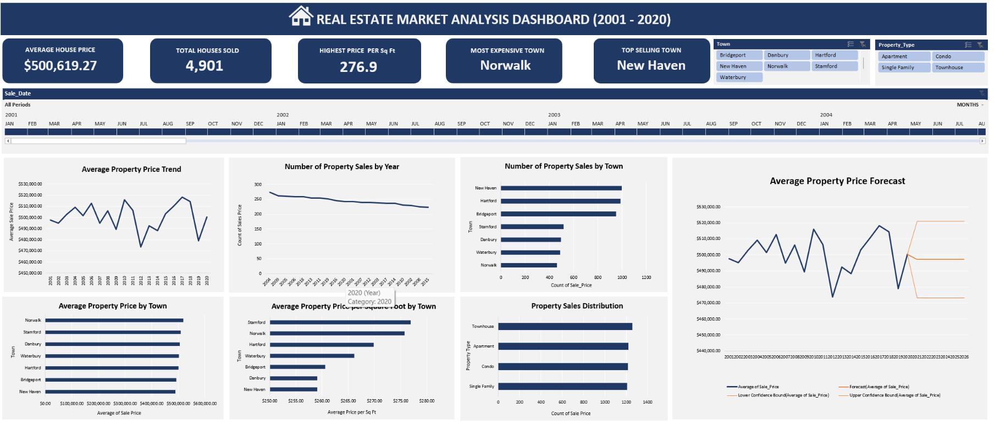

# Real Estate Market Analysis
Real estate investors and businesses often need reliable information before deciding where and when
to invest in properties. Property prices, land values, and market activity can vary significantly from one town to another. Without proper analysis, investment decisions may rely mostly on assumptions rather than actual data.

This project analyzes residential property sales data from 2001 to 2020 to understand housing market trends across different towns. The goal is to provide useful insights that can help investors, real estate professionals, and property businesses make better strategic decisions about property investments and pricing.

## Business Problem
Investors and real estate businesses face several important questions when entering the housing market:

- Which towns have the highest real estate activity?

- Which locations have the most expensive properties?

- Where are land and property prices relatively lower?

- How can investors identify areas that may offer better opportunities for investment?

- What future trends might affect property pricing?

Without clear analysis, it becomes difficult to make informed investment decisions.

## Objective of the Analysis
The objective of this project is to analyze historical real estate sales data and identify market trends that can support investment planning and pricing strategies.

- The analysis focuses on:

- Identifying towns with high property demand

- Comparing housing prices across different towns

- Understanding price differences per square foot

- Analyzing market activity levels

- Forecasting future property price trends

## Data Analysis Process

The dataset was analyzed using Microsoft Excel. Several Excel tools were used to organize, analyze, and visualize the data.

The main steps includes;

- Cleaning and organizing the dataset

- Creating pivot tables to summarize property sales data

- Calculating key performance indicators (KPIs)

- Building interactive charts and filters

- Using slicers and timeline filters to explore the data by town, property type and year

- Applying Excel forecasting tools to estimate future housing price trends

- Designing an interactive dashboard to present the results clearly

## Key Insights
- #### Average House Price
  The average property price across the dataset is approximately **$500,619**. This indicates that the real estate market
  maintains relatively high property values across the towns analyzed.

- #### Total Houses Sold
  A total of **4,901** property sales were recorded. New Haven and Hartford appear to have the highest number of transactions, 
  indicating stronger market activity in those towns.

- #### Highest Price per Square Foot
  **Stamford and Norwalk** have the highest property values per square foot, suggesting these towns have the most expensive real estate market
  relative to property size. In contrast, **Danbury and New Haven** show lower price per square foot, indicating more affordable housing markets.

- #### Most Expensive Town
  **Norwalk** appears as the most expensive town based on average property prices. This suggests higher value properties in that area compared
  to other towns.

- #### Top Selling Town
  **New Haven** recorded the highest number of property sales, indicating strong market activity and demand, which maybe driven by 
  lower price per square foot.

- #### Property Type Distribution
  The distribution of property sales shows that **townhouses and apartments** represent the largest portion of the market, 
  indictaing these property types are in high demand or most popular among buyers.

- #### Forcasting Property Market Trends
  The forecast predicts that average property prices will likely remain stable around **$497,000** in the coming years. 
  However, the confidence interval indicates that prices could vary between approximately **$473,000 and $521,000** due to flunctuation
  observed in historical data.

## Investment Insights and Recommendations
Based on the analysis, a few observations may help investors think about possible opportunities in the housing market.

Towns with a high number of property sales, such as **New Haven and Hartford**, show strong market activity. Areas like this often have steady buyer interest, which can make it easier for investors who want to buy or sell properties in an active market.

Some towns also stand out when looking at price per square foot. For example, **Stamford and Norwalk** shows higher value, suggesting that property space in those areas tends to carry stronger value compared to other towns.

The analysis also shows that certain towns, such as **New Haven and Bridgeport**,have lower average property prices compared to others. And also towns, such as **New Haven and Danbury** have lower property price per square foot. For investors, these locations may present opportunities to enter the market at a lower cost.

Looking at the forecast, the housing market appears fairly steady in the coming years. This suggests that investors may want to focus more on choosing the right towns and property types rather than expecting sudden changes in overall market prices.

These insights are not meant to tell investors exactly what to do, but they provide useful observations from the data that can help guide better investment decisions.

## Dashboard
Below is the interactive dashboard created in Excel to summarize the analysis and allow users to explore the data visually.

## Conclusion
This project demonstrates how Excel can be used to analyze real estate market data and uncover meaningful insights about property pricing, market activity, and investment opportunities.

By combining pivot tables, forecasting tools, and interactive dashboards, the analysis provides a clearer understanding of housing market patterns across towns and identify trends over years. These insights can support investors and real estate professionals when evaluating potential markets and planning future investments.

